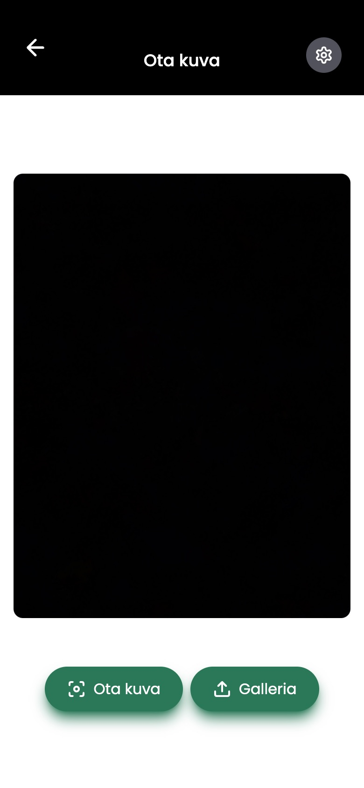
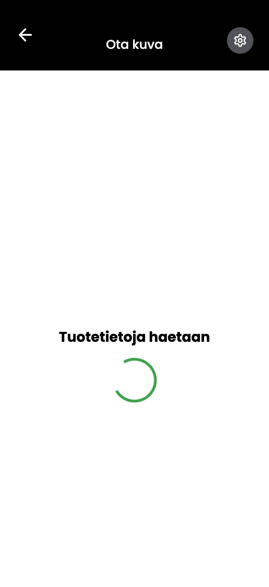
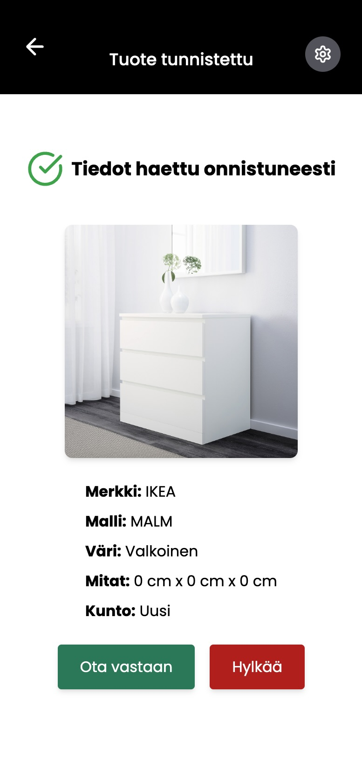
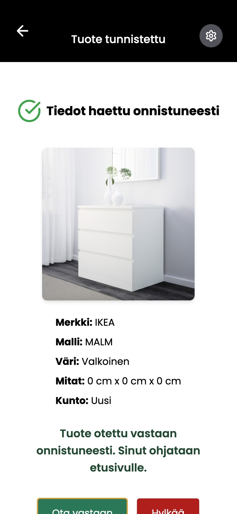
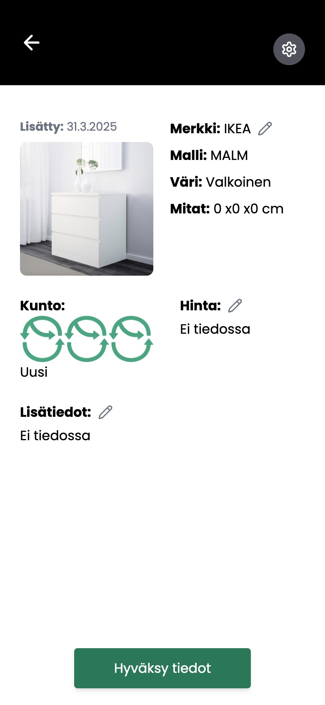
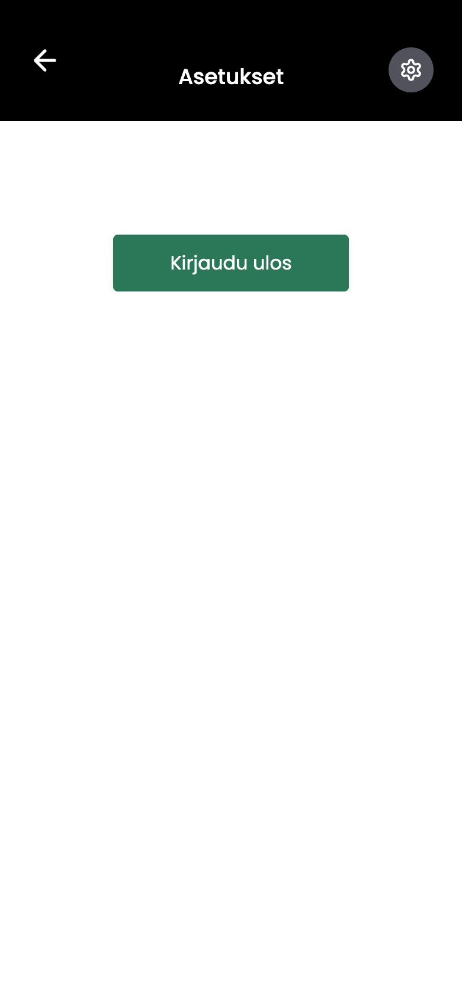

# Kalustearvio - Mobile | Frontend

Frontend application for the Älyä-hanke KalusteArvio-project that is meant for mobile use. The app uses AI to analyze furniture and other object images and provides information for drivers and store worker about the object and whether or not to take the object or not. The app also allows experts the chance to modify AI provided information and and decide where the object should go.

## Core Features

### Drivers and Store Workers

1. Take a picture or upload one of furniture or other object for AI analysis
2. Either take the piece of furniture or other object or don't

### Experts

1. Modify AI information for furniture or other objects
2. Decide whether the furniture or other object goes to the workshop or store

## Tech Stack

- **React + TypeScript + Vite**
- **UI**: Tailwind CSS

## Installation

To run the program, follow the instructions below:

**1. Clone the Github repository:**

`git clone https://github.com/team-alya/kaluste-frontend-25K.git` 

**2. Install dependencies:**

`npm install`

**3. Start the app:**

`npm run dev`

## Notice

For this app to work with all its functionalities you also need to have the back-end set up which can be found with its own documentation here: https://github.com/team-alya/kaluste-backend-25K.

## Images of the user interface

#### Login Page

#### Front Page

#### Camera View

#### Picture Taken/Uploaded

#### Loading View

#### Indentified View

#### Accepted View

#### Listed objects View

#### Object Page View

#### Settings Page

